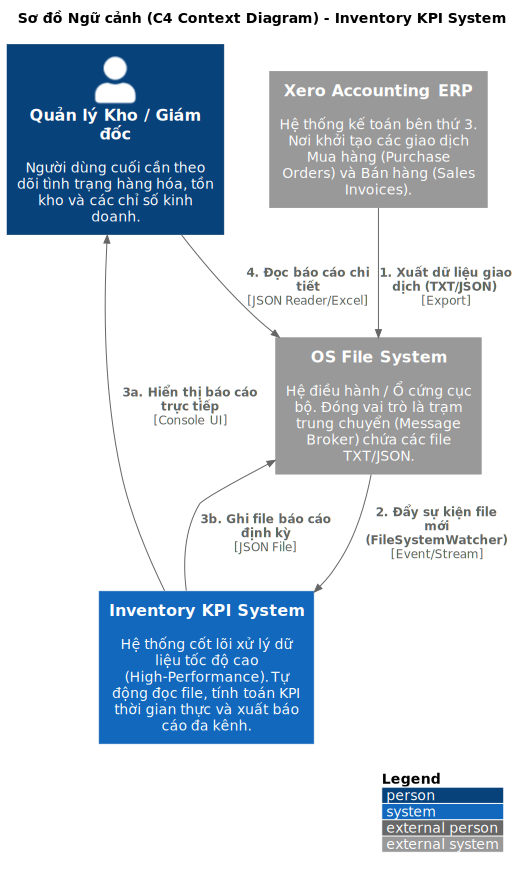
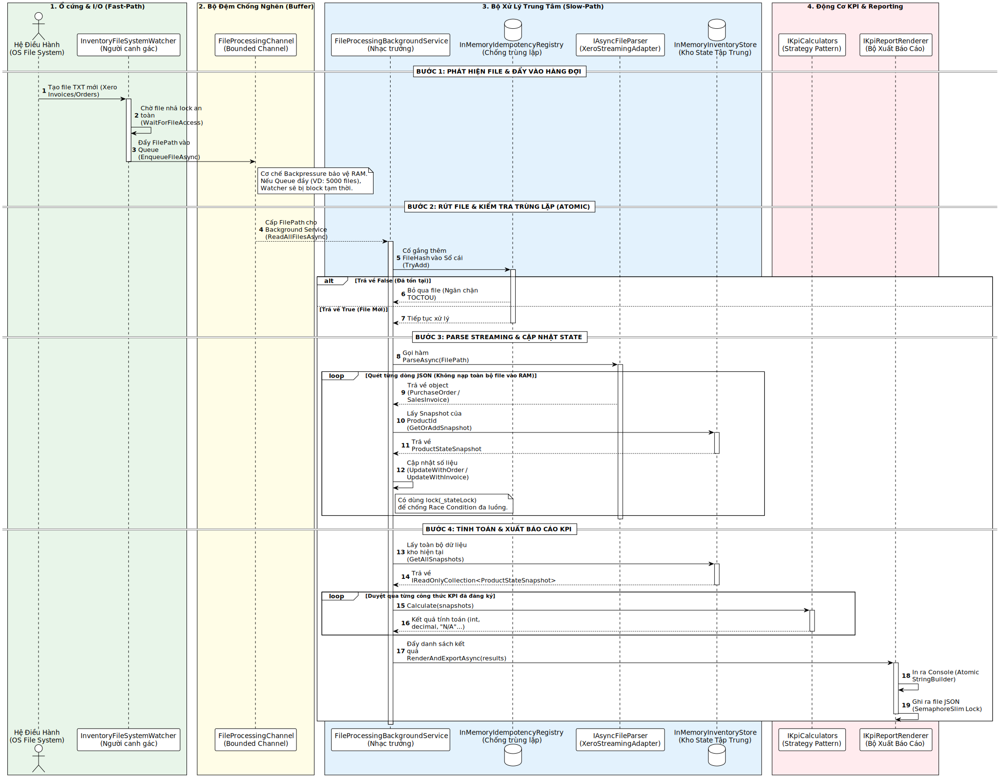
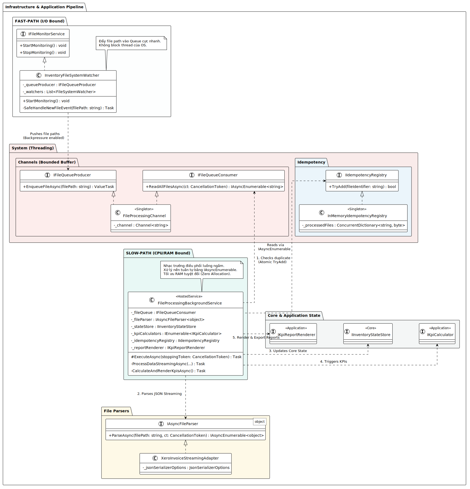
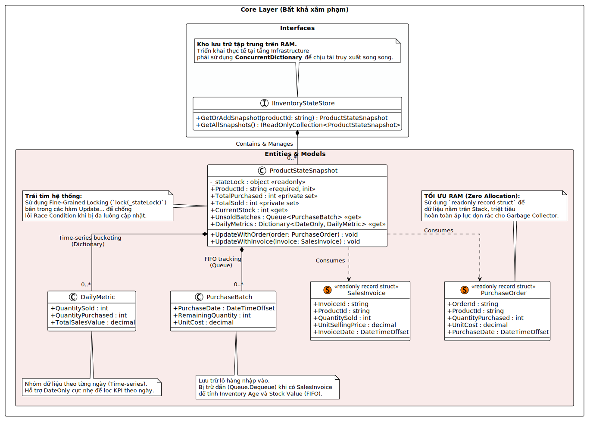
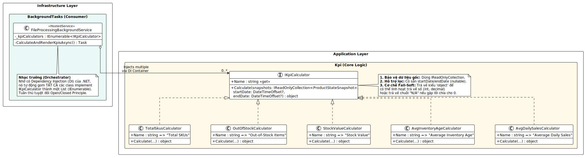
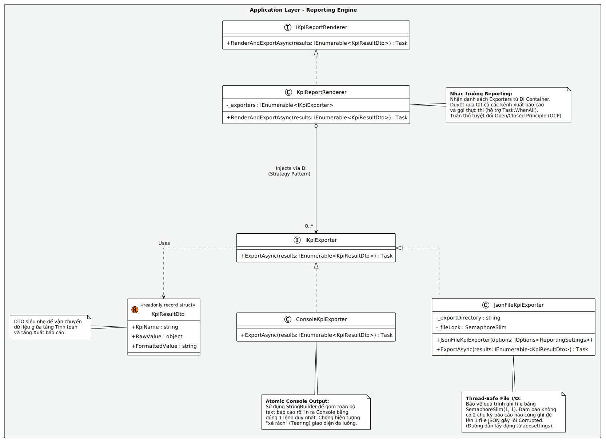

# 🚀 High-Performance Inventory KPI System

Hệ thống xử lý tệp dữ liệu giao dịch (Xero Invoices/Orders) tốc độ cao, hỗ trợ tính toán chỉ số KPI hàng tồn kho theo thời gian thực. Dự án được thiết kế theo chuẩn **Clean Architecture** và tối ưu hóa **High-Performance** cho .NET 8, giải quyết triệt để các bài toán về Đa luồng (Multi-threading) và Tối ưu bộ nhớ (Memory Optimization).

## ✨ Tính năng Công nghệ Nổi bật (Core Technical Highlights)

* **High-Performance & Zero Allocation:** Sử dụng `readonly record struct` và `IAsyncEnumerable` để nạp luồng tệp (Streaming JSON) mà không làm tràn RAM (OOM) hay tạo rác cho Garbage Collector.
* **Concurrency & Thread-Safety:** Tầng Core được bảo vệ bằng `ConcurrentDictionary` và khóa hạt mịn (`lock`), loại trừ 100% rủi ro Race Condition khi hàng chục luồng cùng đọc/ghi dữ liệu.
* **Producer-Consumer Pipeline:** Ứng dụng `System.Threading.Channels` kết hợp với `FileSystemWatcher` tạo cơ chế Kháng áp lực (Backpressure), giúp hệ thống không bị quá tải khi xử lý hàng vạn tệp cùng lúc.
* **Atomic Idempotency:** Tích hợp bộ nhớ đệm (Atomic `TryAdd`) để chặn tệp trùng lặp, bảo vệ dữ liệu gốc khỏi lỗi tranh chấp thời gian (TOCTOU).
* **SOLID & Strategy Pattern:** Động cơ tính KPI và xuất báo cáo cực kỳ linh hoạt (Open/Closed Principle), dễ dàng "Plug-and-play" thêm công thức hoặc kênh xuất (Console, JSON) thông qua Dependency Injection.

---

## 🏗️ Kiến trúc Hệ thống (System Architecture)

Dự án được phân rã thành các module độc lập, tuân thủ chặt chẽ ranh giới tài nguyên (I/O-Bound vs CPU-Bound). 

### 1. Sơ đồ Ngữ cảnh Toàn cục (C4 Context)
Hệ thống đóng vai trò là trung tâm xử lý dữ liệu tự động, giao tiếp lỏng lẻo (Decoupled) với hệ thống Xero ERP thông qua OS File System.


### 2. Luồng dữ liệu Tuần tự (DataFlow)
Minh họa vòng đời của một tệp từ lúc được phát hiện (Fast-Path), đi qua bộ đệm (Channel), phân giải luồng, tính toán và xuất báo cáo (Slow-Path).


### 3. Đường ống Xử lý (File Processing Pipeline)
Triển khai mẫu Producer-Consumer và Adapter Pattern để cô lập logic phân giải định dạng của bên thứ ba.


### 4. Tầng Cốt lõi & Khóa Đa luồng (Domain Entities)
Cấu trúc Aggregate Root với cơ chế Fine-Grained Locking và Time-series bucketing bảo vệ tính toàn vẹn dữ liệu.


### 5. Động cơ Tính toán (KPI Calculation Engine)
Thiết kế "Cắm và Chạy" sử dụng Strategy Pattern, hỗ trợ cơ chế Fail-Soft an toàn.


### 6. Kiến trúc Xuất báo cáo (Reporting Strategy)
Xuất báo cáo đa kênh đồng thời với cơ chế Atomic Console Output (StringBuilder) và Thread-Safe File I/O (SemaphoreSlim).


---

## 🚀 Hướng dẫn Cài đặt & Chạy (Getting Started)

**Yêu cầu môi trường:**
* .NET 8.0 SDK trở lên.
* Trình soạn thảo Visual Studio 2022 hoặc VS Code.

**Các bước khởi chạy:**
1. Clone kho lưu trữ này về máy.
2. Mở Terminal tại thư mục gốc của dự án.
3. Build toàn bộ Solution để khôi phục các gói NuGet:
   ```bash
   dotnet build
4. Chạy project Host (Nhạc trưởng):
   ```bash
   dotnet run --project src/InventoryKpiSystem.Host/InventoryKpiSystem.Host.csproj
5. Kéo thả các tệp dữ liệu giao dịch (định dạng `.txt`) vào thư mục theo cấu hình giám sát để xem hệ thống tự động xử lý và tính toán KPI theo thời gian thực.

---

## 📂 Cấu trúc Dự án (Project Structure)

Dự án áp dụng Clean Architecture, phân tách rõ ràng trách nhiệm của từng tầng:

* `Core`: Chứa Domain Entities, Value Objects và Interfaces cốt lõi (Bất khả xâm phạm).
* `Application`: Chứa Engine tính toán KPI (Strategy), DTOs và các hợp đồng giao tiếp báo cáo.
* `Infrastructure`: "Hệ tiêu hóa" nuốt file đa luồng (Background Services, FileSystemWatcher, Json Streaming Parsers, Channels).
* `Host`: Cấu hình Dependency Injection, AppSettings và khởi chạy ứng dụng.
* `Tests`: Bộ Unit Test sử dụng xUnit giả lập các trường hợp dữ liệu rỗng (Edge cases) và kiểm tra logic nghiệp vụ.

---

## 👥 Nhóm Phát Triển (Team)
- Huỳnh Minh Trí - Tech Lead.
- Hứa Thị Ngọc Huyền.
- Võ Lê Khánh Linh.
- Lương Quốc Trung.
